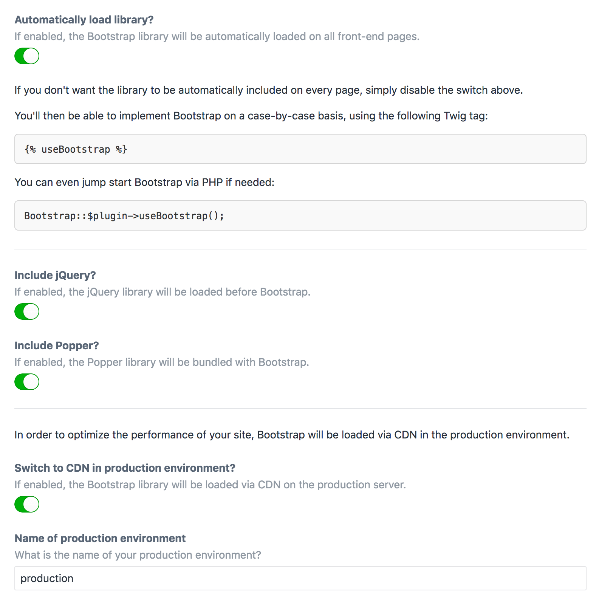

Bootstrap plugin for Craft CMS
==============================

Build your site with the Bootstrap front-end framework.

***

>This is a plugin wrapper for adding Bootstrap to a Craft CMS site.*
>
>Credit for the Bootstrap library belongs to the [Bootstrap](https://getbootstrap.com/) team.

***

_* The version number of this plugin aligns with the version of Bootstrap packaged inside._

***

## Automatically Loads Bootstrap

Once you've installed the plugin, the Bootstrap CSS and JS files will immediately be loaded into the front-end of your site. If you don't want them to be included on every page, you can disable auto-loading on the Settings page.

If you've disabled auto-loading, you can have Bootstrap load only on the pages where you need it:

```twig

```

It doesn't matter where on the page you add that tag... the Bootstrap assets will be loaded as long as it exists somewhere in your Twig template.

In the rare case where you may want to load the assets via PHP, that's possible too:

```php
Bootstrap::$plugin->useBootstrap();
```

***

## Uses a CDN in production

To lighten the load, this plugin will switch to loading Bootstrap via a CDN when it runs in a production environment.

If you don't want this feature, or if your production environment uses a name other than `production`, you can control those details on the Settings page.

***

## Settings



***

## Anything else?

We've got other plugins too!

Check out the full catalog at [doublesecretagency.com/plugins](https://www.doublesecretagency.com/plugins)
